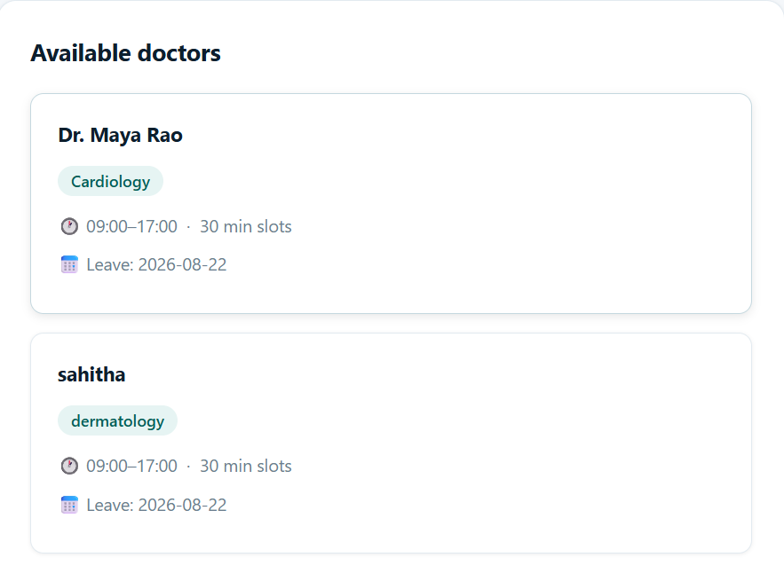
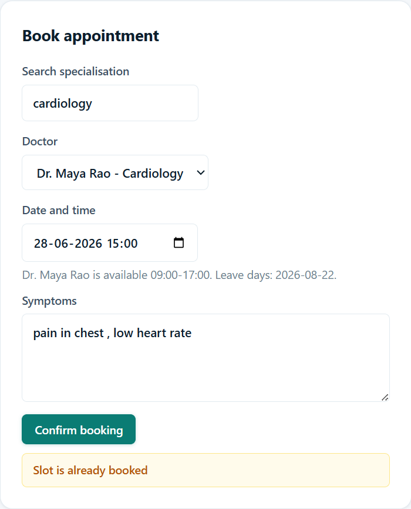
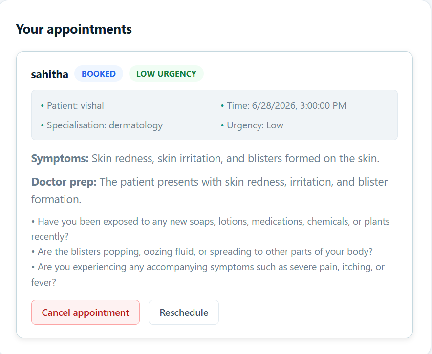
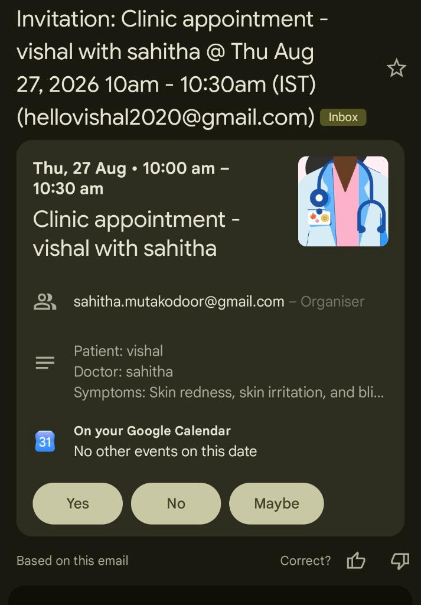

# Healthcare Appointment & Follow-up Manager

## Overview

A clinic appointment platform with three role-based portals — patient, doctor, and admin. Patients book appointments and submit symptoms in advance; an LLM generates a pre-visit urgency summary for the doctor and a patient-friendly post-visit summary after the consultation. Both sides get email and Google Calendar updates on booking, reschedule, and cancellation, and patients get automated medication reminders based on their prescription.

A dependency-free Node.js demo application for a clinic appointment workflow with three separate interfaces:

- Patient portal: `/patient.html`
- Doctor portal: `/doctor.html`
- Admin portal: `/admin.html`

The app implements role-based login, doctor search, appointment booking with symptom capture, double-booking prevention, doctor leave handling, pre-visit and post-visit AI-style summaries, email/calendar outboxes, and medication reminder scheduling.

## Live Demo

- Hosted URL: `<add your deployed link here>`
- Local: `http://localhost:3000` after following Setup Guide below

**Demo Accounts**

| Role    | Email                 | Password     |
| ------- | --------------------- | ------------ |
| Admin   | `admin@clinic.test`   | `admin123`   |
| Doctor  | `maya@clinic.test`    | `doctor123`  |
| Patient | `patient@clinic.test` | `patient123` |

## Feature Checklist

- [x] Role-based auth (patient / doctor / admin)
- [x] Admin creates and manages doctor profiles (specialisation, working hours, slot duration, leave days)
- [x] Patient registration, login, doctor search by specialisation, slot booking
     
- [x] Double-booking prevention & simultaneous booking handling — see [System Design Write-up](#system-design-write-up)
       
- [x] Doctor leave → affected patients notified automatically
- [x] Pre-visit LLM symptom summary (urgency level, chief complaint, suggested questions)
- [x] Post-visit LLM patient-friendly summary (medication schedule, follow-up steps
      
- [x] Medication reminders based on prescription frequency (background job)
- [x] Email notifications: booking confirmation, reminder, cancellation, reschedule
- [x] Google Calendar sync: create on booking, update on reschedule, delete on cancellation
      
- [x] Graceful LLM failure handling (deterministic fallback summaries)
- [x] Graceful notification failure handling (outbox + retry queue)


## Setup Guide

1. Install Node.js 18 or newer.
2. Copy `.env.example` to `.env` if you want to configure optional integrations.
3. Run the app:

```bash
npm start
```

4. Open `http://localhost:3000`.

No `node_modules` are committed, and the current implementation uses only built-in Node.js modules to keep the submission small.

## Environment Variables

| Name                   | Required | Purpose                                                                                                                          |
| ---------------------- | -------- | -------------------------------------------------------------------------------------------------------------------------------- |
| `PORT`                 | No       | Server port. Defaults to `3000`.                                                                                                 |
| `APP_BASE_URL`         | No       | Public URL for deployment.                                                                                                       |
| `APP_TIME_ZONE`        | No       | Calendar event time zone. Defaults to `Asia/Kolkata`.                                                                            |
| `LLM_API_KEY`          | No       | Gemini API key used to generate clean pre-visit and post-visit summaries. Without it, deterministic fallback summaries are used. |
| `GEMINI_MODEL`         | No       | Gemini model name. Defaults to `gemini-3.6-flash`.                                                                               |
| `BREVO_API_KEY`        | No       | Sends queued transactional emails through Brevo. Without it, emails move through demo outbox states.                             |
| `MAIL_FROM`            | No       | Sender address for real email integration.                                                                                       |
| `MAIL_FROM_NAME`       | No       | Sender display name for Brevo emails.                                                                                            |
| `GOOGLE_CLIENT_ID`     | No       | Google OAuth client id.                                                                                                          |
| `GOOGLE_CLIENT_SECRET` | No       | Google OAuth client secret.                                                                                                      |
| `GOOGLE_REDIRECT_URI`  | No       | OAuth callback URL.                                                                                                              |

## API Docs

All authenticated endpoints use `Authorization: Bearer <token>`.

| Method  | Endpoint                           | Roles          | Description                                                                                                                                                                          |
| ------- | ---------------------------------- | -------------- | ------------------------------------------------------------------------------------------------------------------------------------------------------------------------------------ |
| `POST`  | `/api/auth/login`                  | Public         | Login with `email` and `password`.                                                                                                                                                   |
| `POST`  | `/api/auth/register`               | Public         | Register a patient.                                                                                                                                                                  |
| `GET`   | `/api/me`                          | All roles      | Return current user.                                                                                                                                                                 |
| `GET`   | `/api/doctors?specialisation=`     | Public         | Search doctors by specialisation.                                                                                                                                                    |
| `POST`  | `/api/appointments`                | Patient        | Book a slot with `doctorId`, `startsAt`, and `symptoms`.                                                                                                                             |
| `GET`   | `/api/appointments`                | All roles      | List appointments visible to the current role.                                                                                                                                       |
| `PATCH` | `/api/appointments/:id/cancel`     | Patient, Admin | Cancel an appointment and queue notifications/calendar deletion.                                                                                                                     |
| `PATCH` | `/api/appointments/:id/reschedule` | Patient, Admin | Reschedule a booked appointment to a new slot. Validates availability, updates the Google Calendar event, and queues rescheduled emails to patient and doctor. Body: `{ startsAt }`. |
| `PATCH` | `/api/appointments/:id/visit`      | Doctor         | Save notes and prescription, generate patient summary, schedule medication reminder.                                                                                                 |
| `POST`  | `/api/admin/doctors`               | Admin          | Create doctor login/profile with working hours and slot duration.                                                                                                                    |
| `PATCH` | `/api/admin/doctors/:id/leave`     | Admin          | Mark leave date, cancel affected bookings, notify patients.                                                                                                                          |
| `GET`   | `/api/admin/ops`                   | Admin          | Inspect email, calendar, and medication reminder queues.                                                                                                                             |

## Database Schema

The demo database is JSON at `data/db.json`, created automatically on first run.

| Collection            | Important fields                                                                                                                                           |
| --------------------- | ---------------------------------------------------------------------------------------------------------------------------------------------------------- |
| `users`               | `id`, `role`, `name`, `email`, `password`, `doctorId`                                                                                                      |
| `doctors`             | `id`, `userId`, `name`, `email`, `specialisation`, `workingHours`, `slotDuration`, `leaveDays`                                                             |
| `appointments`        | `id`, `doctorId`, `patientId`, `startsAt`, `symptoms`, `status`, `preVisitSummary`, `clinicalNotes`, `prescription`, `postVisitSummary`, `calendarEventId` |
| `emailOutbox`         | `id`, `to`, `subject`, `body`, `status`, `attempts`, `createdAt`, `lastAttemptAt`                                                                          |
| `calendarEvents`      | `id`, `appointmentId`, `status`, `title`, `attendees`, `startsAt`, `durationMinutes`                                                                       |
| `medicationReminders` | `id`, `appointmentId`, `patientId`, `prescription`, `nextRunAt`, `status`                                                                                  |

For production, replace the JSON store with PostgreSQL or MySQL and enforce a unique index on active appointments: `(doctor_id, starts_at) WHERE status != 'cancelled'`.

## LLM Prompts

Pre-visit prompt:

```text
Analyse these symptoms and return: urgency level (Low / Medium / High), chief complaint, and three suggested questions for the doctor. Symptoms: <symptoms>
```

Post-visit prompt:

```text
Convert these clinical notes into a patient-friendly summary with medication schedule and follow-up steps: <notes>
```

LLM failures are handled gracefully by deterministic fallback functions in `server.js`, so booking and visit completion continue even when Gemini is unavailable.

## Integration Setup

Create `.env` from `.env.example`, add your real keys, then restart the server.

Gemini:

- Add your Google AI Studio key as `LLM_API_KEY`.
- When a patient books, symptoms are corrected and summarized into urgency, chief complaint, cleaned symptoms, and doctor questions.
- When a doctor completes a visit, notes and prescription are converted into a patient-friendly summary.

Brevo:

- Verify `MAIL_FROM` as a sender in Brevo.
- Add `BREVO_API_KEY`.
- Booking confirmations, doctor appointment notices, cancellations, visit summaries, and medication reminders are queued and sent by the background job.
- Check Admin Portal > Notification and calendar queues for `sent`, `failed`, and provider message IDs.

Google Calendar:

- Add `GOOGLE_CLIENT_ID`, `GOOGLE_CLIENT_SECRET`, and `GOOGLE_REDIRECT_URI`.
- In Google Cloud Console, the OAuth client must include this exact redirect URI: `http://localhost:3000/oauth/google/callback`.
- Restart the server.
- Open `http://localhost:3000/oauth/google/start` in the browser and approve Calendar access.
- Book a new appointment. The app creates an event on the connected Google account's primary calendar, invites the doctor and patient emails, sends Google updates, and adds email/popup reminders.

## Google Calendar Setup Steps

1. Create a Google Cloud project.
2. Enable the Google Calendar API.
3. Configure an OAuth consent screen.
4. Create OAuth 2.0 credentials for a web application.
5. Add `GOOGLE_CLIENT_ID`, `GOOGLE_CLIENT_SECRET`, and `GOOGLE_REDIRECT_URI` to `.env`.
6. Open `http://localhost:3000/oauth/google/start` and approve the app.
7. For a production version, store refresh tokens securely per user so patient and doctor calendars can both be updated on booking, reschedule, or cancellation.

## System Design Write-up

The system separates patient, doctor, and admin responsibilities while sharing one backend API. Patients can search doctors by specialisation, submit symptoms, and book an appointment. Doctors see only their own appointments and receive a pre-visit summary with urgency, chief complaint, and suggested questions. After the visit, doctors submit notes and prescriptions, then the system creates a patient-friendly summary and schedules medication reminders. Admins manage doctor profiles, working hours, slot durations, leave days, and operations queues.

Double-booking prevention is handled in two layers. In the demo app, each booking request creates an in-memory lock key from `doctorId` and `startsAt`. While that lock exists, another request for the same slot receives a retry response. After the lock is acquired, the server re-checks the persisted appointments and rejects any active appointment for the same doctor and start time. In production this should be backed by a database transaction plus a partial unique index for active bookings, because multiple server instances cannot share an in-memory lock reliably.

Doctor leave conflict handling is admin-driven. When an admin marks a leave date, the server adds the date to the doctor profile, finds all booked appointments for that doctor on that date, marks them cancelled, queues patient email notifications, and marks related calendar events for deletion. This keeps the original records for audit while making the slot unavailable for future booking.

Rescheduling reuses the same slot validation and locking logic as booking. The patient picks a new date and time from an inline form on their appointment card. The server acquires the slot lock, runs isSlotAvailable excluding the current appointment, updates the startsAt field, and calls the Google Calendar events PUT endpoint with sendUpdates=all so both patient and doctor receive an updated calendar invitation automatically. If the Calendar API fails the appointment is still rescheduled locally and the calendar event is marked update-failed for manual review.

The slot hold mechanism is intentionally short-lived. The app validates the selected date, working hours, leave status, and active appointment conflicts immediately before confirmation. A production version can add a temporary `slot_holds` table with expiry timestamps, allowing a patient to hold a slot while completing forms or payment. Expired holds should be removed by a background job.

Notification reliability uses outbox tables. Booking, cancellation, leave, visit summary, and medication events are first written to the database as queued work. A background job retries pending email work and can be extended to process Google Calendar updates. This avoids losing notifications when SendGrid, Mailgun, Nodemailer, or Google Calendar are temporarily unavailable. Failed attempts should keep retry counts and last error messages, then move to manual review after a maximum retry count.

## Deployment

This can be deployed to Render, Railway, Fly.io, or any Node.js hosting service.

Recommended start command:

```bash
npm start
```

Because this demo writes `data/db.json` locally, production deployment should use a persistent disk or a real database.
